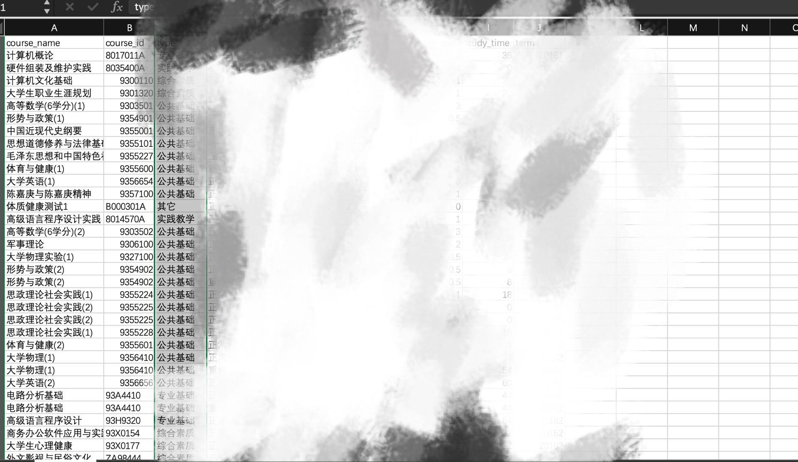

# Little_spider
**使用前请详细阅读**  
1. 本程序需要使用`Pycharm`环境来运行
2. 使用前请确保有`Scrapy`、`Selenium`常用爬虫库
3. 使用前请确保`Chrome`以`debug`模式运行在`9200`端口下
   ```python
   ## 方法
   ## 关闭当前浏览器 
   ## Google\ Chrome.app/Contents/MacOS/Google\ Chrome --remote-debugging-port=9222
   ## Chrome输入127.0.0.1:9200/json 查看是否成功
   ``
4. `spider`文件夹下的`score.py`是主文件,第一次使用前请去掉注释,第二次抓取到`cookies`以后可以打上注释  
5. 成功以后会自动生成cyjw.csv文件 
